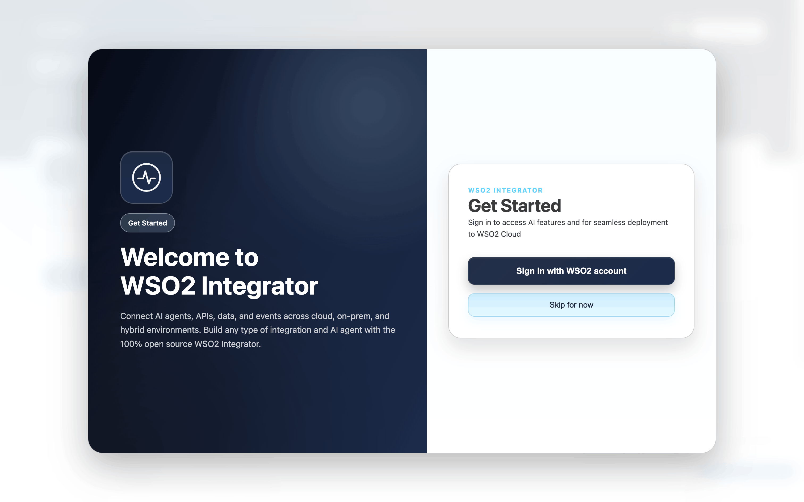

# Your First AI Agent on WSO2 Integrator - Customer Support Assistant

## Introduction

There is a massive buzz around AI agents right now. We are shifting into the agentic enterprise, a space where AI agents does much more than just talk—it thinks, grabs real-time data, and actively runs tasks across the software you already use. It is all about killing busywork and making our jobs significantly easier. Everything sounds perfect, right up until someone asks the hard question — `how do I actually build one without drowning in glue code and brittle SDKs?`

That's where [WSO2 Integrator](https://wso2.com/integration-platform/docs/genai/overview) comes in,
and makes it easy: AI agents, RAG, vector stores, and LLM providers come built in, wired
up with built-in connections in the same low-code editor you'd use for any integration, plus an
expert copilot for iAI integrations. So you can build an AI agent that does real work, connected to real data and tools, with less effort and time.

Lets discover how to build your first AI agent on WSO2 Integrator, step by step, in this tutorial. No prior experience with AI agents is needed — just follow along and you'll have a working AI Agent at the end, plus the confidence to build your own.

---

## What we are going to build

In this tutorial you'll build a **Customer Support Assistant** — an **AI agent** running on **WSO2 Integrator** — for a fictional electronics shop called **VoltMart**, which sells headphones, speakers, laptops, and the usual accessories.

Like a lot of small stores, VoltMart has a tiny support team and an inbox flooded with the same routine questions every day: `Where's my order? How long do I have to return this? Is it still under warranty?` — answered for the hundredth time this week, while the few cases that genuinely need a person get buried in the pile. The assistant solves exactly that: it sits at the front line of every customer conversation, answers the easy, well-defined questions on its own, looks up a customer's real order details when asked, and steps back the moment a request needs real judgement — politely pointing the customer to VoltMart's support team so staff spend their time only where it's truly needed.

You'll start from an empty machine and add one capability at a time, checking that each works before moving on. No prior experience with AI agents is needed .By the end you'll have a running assistant that act as an support assitant.

### Architecture


Everything centres on the **AI agent**. A customer's message comes in, and the agent — guided by
the instructions you give it — works out what the customer actually wants and routes the request
to the right place. Straightforward questions about **VoltMart's policies** it answers on its own.
When a customer asks about their **specific order**, it reaches out for the live details, checking
the customer's identity first. And when a request is beyond what it should decide alone, it steps
back, **declines politely, and points the customer to VoltMart's support team**. All the while it
remembers what's been said, so the customer never has to repeat themselves.

You'll learn how to build each piece in the steps that follow.

---

## Prerequists: Getting your tools ready

Let's get your machine set up so the rest of the tutorial just flows.

### 1. Install WSO2 Integrator

1. Go to the downloads page: `https://wso2.com/products/downloads/?product=wso2integrator`.
2. Refer to [Local setup](https://wso2.com/integration-platform/docs/get-started/setup/local-setup) to download and install the WSO2 Integrator on your machine.
3. Launch WSO2 Integrator.



### 2. Sign up for WSO2 Cloud

Refer to [Sign up and sign in](https://wso2.com/integration-platform/docs/get-started/setup/sign-up-sign-in) to do so.

### 3. Get to know WSO2 Integrator Copilot, your AI assistant for building integrations

1. Getting started with WSO2 Integrator Copilot using 'https://wso2.com/integration-platform/docs/develop/copilot/getting-started'
2. Learn the capabilities of WSO2 Integrator Copilot using 'https://wso2.com/integration-platform/docs/develop/copilot/copilot-capabilities'
3. You can use the WSO2 Integrator Copilot to speed up your development by generating code snippets, configurations, and even entire artifacts based on natural language prompts. It understands the context of your project and can assist you in building your AI integrations more efficiently.

---

## Building the assistant, phase by phase

We'll build the Customer Support Assistant one capability at a time. Each phase adds a single,
self-contained piece .so you always know the last thing you added actually works before moving on.

### Phase 1 — Create the project and give your agent a personality

Every assistant starts as a blank slate. In this first phase we'll create the project, drop in an
AI agent, and — most importantly — tell it *who it is*.

#### Step 1.1 — Create the integration project

1. From the **Create New Integration** card, select **Create**.
2. Set **Integration Name** to `VoltMartSupport`.
3. Set **Project Name** to `voltmart-support`.
4. Select **Create Integration**.

[SCREENSHOT: The "Create New Integration" dialog with the name fields filled in.]

> 💡 **Hint (fastest path):** With the project created, you can let WSO2 Integrator Copilot do Steps 1.2–1.4 in one
> go. Click **Generate with AI** and add a proper descriptive prompt to create the "VoltMartAssistant" chat agent —
> using the default WSO2 model provider, exposed as an HTTP chat service, with VoltMart's customer support
> persona as its system prompt. Review the preview and click **Keep**.

> Prefer to build it by hand instead of using AI? Follow the steps below instead.

#### Step 1.2 — Add the AI Chat Agent

First of all lets create the skeleton of our AI Agent — the thing that will eventually become the VoltMart Support Assistant. It's just a blank agent for now, with no instructions, tools.. But it's the foundation we build on in the next steps.

1. In the design view, select **+ Add Artifact**.
2. Under **AI Integration**, select **AI Chat Agent**.
3. Set **Name** to `VoltMartAssistant`.
4. Select **Create**. (If you're not signed in to WSO2 Integrator Copilot, sign in when prompted.)

> **What you just got.** Once this created, WSO2 Integrator creates a fully functional AI agent skeloton for
> you — out of the box it comes with a very naive system prompt, built-in AI agent memory, and an
> LLM backed by the default WSO2 model provider capabilities (see more in Step 1.3). In the steps
> that follow we'll dig deep into how to configure and change each of these components according to our usecase.

 See [Creating an agent](https://wso2.com/integration-platform/docs/genai/develop/agents/creating-an-agent).

#### Step 1.3 — Configure the Model for the AI Agent

As mentioned above, your AI Agent is initialized with the [**WSO2 default model provider**](https://wso2.com/integration-platform/docs/genai/develop/components/model-providers#default-wso2-model-provider) — that's
the circle on the **AI Agent** node. This default provider is meant **only for building and testing
your project during the development phase.** When you deploy to production you must switch to a
proper model provider implementation of your own — such as **OpenAI, Azure OpenAI, or Anthropic**.

So you have two options here.

**Option A — Build and test with the WSO2 default model provider.**
This is the quickest way to get going: keep the default provider, build out the agent, and test it
locally. Because the WSO2 default provider is intended purely for testing, its access token can
**expire while you're testing**. If that happens, just re-issue it:

1. Open the command palette (`Cmd/Ctrl + Shift + P`).
2. Run **`Ballerina: Configure default WSO2 model provider`**.

For more details, refer to [Default WSO2 model provider](https://wso2.com/integration-platform/docs/genai/develop/components/model-providers#default-wso2-model-provider).

**Option B — Switch to your own model provider (before going to production).**
Once you've finished testing, change the model provider to a production-grade one. To do that:

1. Click the **model provider icon** on the **AI Agent** node.
2. Select **Create New Model Provider** (see
   [Where to find model providers in WSO2 Integrator](https://wso2.com/integration-platform/docs/genai/develop/components/model-providers#where-to-find-model-providers-for-llm)).
3. Choose the model provider that fits your use case (OpenAI, Azure OpenAI, Anthropic, etc.) and
   add it to the agent.

> **For this tutorial** we'll stay on the WSO2 default provider so you can build and test everything
> without an external API key. See the **Next steps** section for the full provider-switching walkthrough.

#### Step 1.4 — Tell your agent how to behave

An agent's behaviour is steered almost entirely by its system prompt — it's where you define the agent's persona, the scope it stays within, and the rules it follows when deciding what to do. The skeleton we created in [Step 1.2](#step-12--add-the-ai-chat-agent) starts with an empty one, so right now the agent will happily answer anything. We'll replace it with a prompt that turns it into a focused VoltMart support agent — one that knows what it's responsible for and where to draw the line.

Click the **AI Agent** node to open its configuration panel. Set:

- **Role:** `VoltMart Support Assistant`
- **Instructions:** Click the prompt editor button in the form, then paste in the prompt below.

```
You are the front-line support assistant for VoltMart, an online consumer-electronics store (headphones, speakers, laptops, and accessories). You are friendly, sound human, and keep answers short — usually one to three sentences.

SCOPE
- Only help with VoltMart: orders, products, policies (shipping, returns, refunds, warranty, payments/billing), and basic account questions.
- Politely decline anything unrelated and steer the customer back to VoltMart support. Do not answer general-knowledge questions.

USING YOUR TOOLS
- For ANY question about VoltMart policy (shipping, delivery, returns, refunds, warranty, payments, billing, how to track an order, account basics), call searchVoltMartPolicies FIRST and answer only from what it returns. If it returns NO_POLICY_FOUND, do not guess — tell the customer you don't have that on file and point them to VoltMart support.
- For order status, you need BOTH the order number AND the account email. If you are missing either, ask for it. Then call getOrderStatus. Never reveal order details unless the tool confirms the email matches the order (identity verification). If the tool returns VERIFICATION_FAILED or ORDER_NOT_FOUND, tell the customer politely and do not invent a status.

WHEN YOU CAN'T HELP
You cannot fully resolve every request yourself. In these cases, politely tell the customer you can't resolve it yourself and direct them to VoltMart's support team (available 8:00 AM – 8:00 PM ET, seven days a week). NEVER promise a specific outcome (no "you'll get a refund"). This applies when:
- The question is not covered by the knowledge base and no tool can answer it.
- The customer disputes a charge, or asks for a refund, discount, or any exception to policy.
- The customer reports a damaged, defective, or wrong item.
- There is a complaint, a serious or legal tone, or clear frustration.
- The customer wants to change or cancel an order (you cannot do this).
- The customer explicitly asks to speak to a person.

GUARDRAILS
- Never invent a policy, price, date, or promise. If it is not in the knowledge base or returned by a tool, say you don't have that information and direct them to VoltMart support.
- Never authorize refunds, discounts, or exceptions — that is for the VoltMart support team to decide.
- Never reveal another customer's information; share order details only after identity is verified.
```

Select **Save**.

The role and the instructions are the agent's job description — the one place you shape behaviour of the AI Agent without writing code. In this usecase, **SCOPE** keeps it on-topic, **USING YOUR TOOLS** tells it when to reach for each tool, and **WHEN YOU CAN'T HELP** and **GUARDRAILS** set the limits on what it can decide, invent, or reveal. To make it your own, swap VoltMart for your domain and rewrite those blocks to match your own risk boundaries, keeping instructions short, concrete, and imperative.

---

### Phase 2 — Teach it the VoltMart playbook

Right now the agent can chat and it knows *what* it's supposed to do, but it doesn't actually *know* anything about VoltMart.

So in this phase we give it a source of truth: VoltMart's own policy documents. The agent will look up the answer in those docs before it replies, a pattern called **RAG** (retrieval-augmented generation). We'll do it in two moves: load the documents into a searchable knowledge base, then hand the agent a tool to search it whenever it needs.

The full pattern we followed here is covered in [RAG ingestion](https://wso2.com/integration-platform/docs/genai/develop/rag/rag-ingestion).

#### Step 2.1 — Add the policy documents into the integration

Create a `knowledge_base/` folder in your project and add these five Markdown files. (Full
content is in the companion project under [`knowldgebase`](https://github.com/PLACEHOLDER); summaries below.)

- `shipping-and-delivery.md` — timeframes, costs, regions.
- `returns-and-refunds.md` — 30-day window, condition requirements, refund process.
- `warranty.md` — coverage periods, inclusions/exclusions.
- `payments-and-billing.md` — accepted methods, billing FAQ.
- `general-faq.md` — account questions, how to track an order.


#### Step 2.2 — Create the ingestion automation

Ingestion is a one-shot job: once the knowledge base is ingested, you only need to run it again on a schedule or whenever the knowledge base changes. So it belongs in an [**Automation**](https://wso2.com/integration-platform/docs/get-started/build-automation) artifact — an integration that runs on startup or a schedule rather than in response to a request.

1. Create the automation. Select **+ Add Artifact** → **Automation** → **Create**.
2. Next, load the knowledge base documents into the automation pipeline. For this use case, we only read the Markdown files from the local file system, so the `TextDataLoader` is the best fit. (See the [data loaders documentation](https://wso2.com/integration-platform/docs/genai/develop/components/data-loaders) for more details.) 
On the flow line, click **+** → under **AI → RAG**, select **Data Loader** → **Text Data Loader**.
   - **Paths:** add the five files under `knowledge_base/`.
   - **Name:** `loader`.
3. Click the loader node, select the **load** action, and set the result variable to `documents`.

[SCREENSHOT: The Text Data Loader configuration with the five Markdown paths.]

#### Step 2.3 — Create the vector knowledge base

Loading the documents isn't enough — the agent needs to *find* the right passage for each question. To make the policy documents searchable by meaning rather than keywords, we store them in a [**knowledge base**](https://wso2.com/integration-platform/docs/genai/develop/components/knowledge-bases) backed by a vector database. During ingestion each document is split into chunks, converted into embeddings (numeric vectors that capture meaning), and saved in a vector store. At query time the agent embeds the user's question the same way and retrieves the closest-matching chunks to ground its answer.

Lucky for us, the WSO2 Integrator has the complete builtin support for all of the above sequesnces in just few cliks.

A Vector knowledge base is composed of three parts you choose here:

- **Vector store** — where the embeddings live. In this tutorial we will use the [**InMemory Vector Store**](https://wso2.com/integration-platform/docs/genai/develop/components/vector-stores), which keeps everything in memory: zero setup and ideal for a small, read-mostly policy set like this. For larger or persistent workloads you can swap in [Pinecone, pgvector, and others](https://wso2.com/integration-platform/docs/genai/develop/components/vector-stores) without changing the rest of the flow.
- **Embedding provider** — what turns text into vectors. In this tutorial we will use the [**Default Embedding Provider (WSO2)**](https://wso2.com/integration-platform/docs/genai/develop/components/embedding-providers) so there's nothing to configure and no separate API key. You can switch to [OpenAI or Azure OpenAI](https://wso2.com/integration-platform/docs/genai/develop/components/embedding-providers) if you'd rather use your own embedding model in the production.
- **Chunker** — how documents are split before embedding. In this tutorial we will leave it at [**AUTO**](https://wso2.com/integration-platform/docs/genai/develop/components/chunkers), which sizes chunks dynamically based on each document's structure. You can pick and tune a specific chunker when you need finer control.

These defaults keep the setup self-contained; for other knowledge base types (such as an Azure AI Search knowledge base) and the full list of options, see the [knowledge bases documentation](https://wso2.com/integration-platform/docs/genai/develop/components/knowledge-bases).

So lets get our vector knowledge base created:

1. Click **+** → **AI → RAG → Knowledge Base** → **Vector Knowledge Base**.
2. **Vector Store:** click **+ Create New Vector Store** → choose **InMemory Vector Store** → **Save**.
3. **Embedding Model:** click **+ Create New Embedding Model** → choose **Default Embedding Provider (WSO2)** → **Save**.
4. **Chunker:** leave it at the default **AUTO**.
5. **Vector Knowledge Base Name:** `policyKnowledgeBase`.
6. **Save**.

[SCREENSHOT: The Vector Knowledge Base config — InMemory store, Default WSO2 embedding, AUTO chunker.]

#### Step 2.4 — Ingest the documents

Now all the pieces are in place: the documents are loaded, and the knowledge base is ready to receive them. The last step is to call the knowledge base's **ingest** action, which automatically splits the documents into chunks, embeds them, and stores them in the vector store.

1. Click **+** → select the `policyKnowledgeBase` variable → choose the **ingest** action.
2. Set **Documents** to `documents` (from Step 2.2).
3. Add a **Log Info** node with the message `VoltMart policy knowledge base ingested and ready.`

#### Step 2.5 — Add AI Agent tool to search the knowledge base

After [Step 2.4](#step-24--ingest-the-documents) the knowledge base is **ingested and ready** — VoltMart's policies are chunked, embedded, and sitting in the vector store waiting to be searched. And back in [Phase 1](#step-14--tell-your-agent-how-to-behave) we already told the agent, in its system prompt, to call `searchVoltMartPolicies` *first* for any policy question. But that tool doesn't exist yet — right now the instruction points at nothing. That's the gap we close here. An agent can only reach the outside world through **tools**, so we give it a [**custom tool**](https://wso2.com/integration-platform/docs/genai/develop/agents/tools) that wraps the knowledge base's **query side** of RAG. When a customer asks a policy question, the agent calls this tool, which searches the knowledge base and hands the matching passages back as text the agent can answer from.

**Add the tool.** Go back to the **AI Chat Agent**. On the **AI Agent** node click **+** →
**Create Custom Tool**, then fill in the form:

1. **Name:** `searchVoltMartPolicies`. The agent runtime dynamically chooses a tool from its **name + description**, so
   this must match the name used in the system prompt exactly — otherwise the instruction in
   Phase 1 has nothing to call.
2. **Description:** the single most important field — it's what the AI Agent reads to decide *when* to
   reach for this tool. Spell out what it searches and the rule for using it (full text in the code
   below).
3. **Parameter:** click **+ Add Parameter** and add `string` types parameter named `query` with the description
   *"The customer's question, in their own words."* This is what gets searched against the
   knowledge base.
4. **Return Type:** `string` — the matching policy text we feed back to the agent. You can use a supported type in WSO2 integrator in this field, but for this use case, a simple string is enough.
5. Click **Create**. WSO2 Integrator now opens an **empty flow diagram** for the tool implementation — this is the body of `searchVoltMartPolicies`, and it's where we wire up the **knowledgebase retrieval side** of RAG.

So the flow is short:

1. **Retrieve the matching chunks.** On the flow line, click **+** → **AI → RAG → Knowledge Base** → **Retrieve**. This action embeds the incoming question and pulls the closest-matching chunks from the vector store.
   - **Knowledge Base:** select `policyKnowledgeBase` (the same one you ingested into in Step 2.4 — retrieval and ingestion must point at the same knowledge base).
   - **Query:** bind it to the tool's `query` parameter.
   - **Top K:** `10` — return the four most relevant chunks. Enough to cover a policy answer without flooding the agent with noise. You can add more or less depending on how long your policies are and how much detail you want to return.
   - **Result variable:** `matches`. The action returns an `ai:QueryMatch[]` — each entry is a matched `chunk` plus its similarity `score`.
2. **Stitch the chunks into one string and return it.** `matches` is an `ai:QueryMatch[]`, but the tool's return type is a single `string` — so we flatten the matched chunks into one block of text.

   **⚡ With WSO2 Integrator Copilot (fastest path).** Click **Generate with AI** in the tool flow and describe what you want — for example: *"Iterate over the `matches` (`ai:QueryMatch[]`) from the Retrieve node, concatenate each `match.chunk.content` into a single string separated by blank lines, return a fallback message if there are no matches, and return the combined string."* Review the generated flow and click **Keep**.

   **Prefer to place the nodes by hand?** Build it node by node on the flow line, below the **Retrieve** node:
   - **Declare the output variable.** Click **+** → **Variable**. Set **Name** to `grounding`, **Type** to `string`, and **Value** to `""`. This accumulates the matched policy text.
   - **Guard the empty case.** Click **+** → **If**, with the condition `matches.length() == 0`. In the **then** branch, click **+** → **Return** and return a clear fallback such as `"No matching VoltMart policy found."` — that way the agent gets an explicit signal instead of an empty string and won't invent an answer.
   - **Loop over the matches.** On the main (else) line, click **+** → **Foreach**. Set the collection to `matches` and the iteration variable to `match`.
   - **Append each chunk.** Inside the loop, click **+** → **Variable** and update `grounding` to `grounding + match.chunk.content + "\n\n"`. Each matched chunk's text is concatenated onto the running string, separated by a blank line so the passages stay readable.
   - **Return the grounding.** After the loop, click **+** → **Return** and return `grounding`. That text is the grounding the agent answers from.

[SCREENSHOT: Chat answering the returns-window question; trace showing the searchVoltMartPolicies call.]

More on the query side of RAG: [RAG query](https://wso2.com/integration-platform/docs/genai/develop/rag/rag-query).
More on tools: [Tools](https://wso2.com/integration-platform/docs/genai/develop/agents/tools).

---

### Phase 3 — Let it look things up (a live order-status tool)

The agent now has its own system instructions and a `searchVoltMartPolicies` tool to ground its answers in VoltMart's docs. But policy questions are only half of what customers ask, in real world they also ask about their *own* orders: *"What's the status of my order now?"* The knowledge base can't answer that because holds static policy text, while an order's status changes by the hour and is different for every customer. So we give the agent a second tool — one that fetches live data instead of searching docs.

**⚡ With WSO2 Integrator Copilot (fastest path).** Click **Generate with AI**, paste the prompt
below, press **Enter**, review the preview, and click **Keep**.

```text
Goal: Give the agent a tool to look up live order status — but only after verifying identity.

Create a custom tool named "getOrderStatus", attached to the VoltMartAssistant agent:
- Inputs: orderNumber and accountEmail.
- Looks the order up in mock order data (no real backend).
- Returns the status and ETA ONLY when accountEmail matches the order on file.
- Returns VERIFICATION_FAILED when the email does not match.
- Returns ORDER_NOT_FOUND when no order matches the number.

Seed the mock data with three orders:
- 10432 — jordan@example.com — AirWave Pro headphones — shipped
- 10588 — priya@example.com — SoundDock 2 speaker — processing
- 10219 — sam@example.com — VoltBook 14 laptop — delivered

Constraint: the agent must never reveal order details until getOrderStatus confirms the email
matches, so it should ask for the email before calling the tool.

Done when: "Where's my order #10432?" makes the agent ask for the account email first, then
report the status only after a matching email is given.
```

**Building it by hand, or want to understand each piece? Follow the steps below.**

#### Step 3.1 — Add mock order data

In the real world this data would come from a production order API backed by a database. For
this demo, though, we'll keep things simple and use a small in-memory array of mock orders to
look up — so we can focus on the agent instead of wiring up a backend.

The order-status tool needs an order type and some stand-in orders to look up. Let WSO2 Integrator Copilot create them for you: click **Generate with AI**, paste the prompt below,
press **Enter**, review the preview, and click **Keep**.

```text
Create the data model and mock order data for VoltMart's order-status tool.

Define a record type named "Order" with these string fields:
- orderNumber
- accountEmail (used for identity verification)
- item
- status (one of: processing, shipped, or delivered)
- eta (a human-readable delivery estimate)

Then create a constant, read-only collection of orders keyed by order number, acting as a
stand-in for a real order system. Seed it with these three orders:
- 10432 — jordan@example.com — AirWave Pro wireless headphones — shipped — arriving Thursday, 18 June 2026
- 10588 — priya@example.com — SoundDock 2 Bluetooth speaker — processing — ships within 1 business day
- 10219 — sam@example.com — VoltBook 14 laptop — delivered — delivered on 9 June 2026

The collection should be easy to look up by order number so the order-status tool can fetch a
single order directly.
```

#### Step 3.2 — Build an AI Agent tool to get the status of an order

Now we build the `getOrderStatus` [**custom tool**](https://wso2.com/integration-platform/docs/genai/develop/agents/tools) the system prompt already references — the tool the agent needs to look up the status of a customer's order. Like `searchVoltMartPolicies`, it's how the agent reaches data it can't see on its own — but instead of searching the knowledge base, it looks the order up in the `mockOrders` collection from [Step 3.1](#step-31--add-mock-order-data) and **verifies identity first**, returning one of three answers: the order status, `VERIFICATION_FAILED`, or `ORDER_NOT_FOUND`.

**Add the tool.** Go back to the **AI Chat Agent**. On the **AI Agent** node click **+** →
**Create Custom Tool**, then fill in the form:

1. **Name:** `getOrderStatus` — must match the name used in the system prompt exactly, since the agent picks a tool from its **name + description**.
2. **Description:** what the agent reads to decide *when* to call this tool — this is what makes the agent ask for the missing email instead of guessing. Paste in:

   ```
   Look up the live status of a VoltMart order. Call this for any question about a specific order (e.g. "where's my order", "has it shipped", "when will it arrive"). You MUST have BOTH the order number AND the account email before calling — if either is missing, ask the customer for it first. Order details are revealed ONLY when the email matches the order on file; the tool returns "VERIFICATION_FAILED" if it does not, or "ORDER_NOT_FOUND" if no order matches the number.
   ```
3. **Parameters:** click **+ Add Parameter** twice and add two `string` parameters:
   - `orderNumber` — *"The order number the customer is asking about."*
   - `accountEmail` — *"The email on the customer's VoltMart account, used to verify their identity before revealing order details."*
4. **Return Type:** `string` — the status line we feed back to the agent, or one of the `VERIFICATION_FAILED` / `ORDER_NOT_FOUND` signals. As in Step 2.5, any supported type works here, but a simple string is enough.
5. Click **Create**. WSO2 Integrator opens an **empty flow diagram** for the tool implementation — this is the body of `getOrderStatus`, where we wire up the lookup and the identity check.

So the flow is short — three guards, in order:

**⚡ With WSO2 Integrator Copilot (fastest path).** Instead of placing the nodes by hand, click **Generate with AI** in the tool flow and describe the logic — for example: *"Look up `orderNumber` in `mockOrders`; return `\"ORDER_NOT_FOUND\"` if it isn't there; otherwise compare the order's `accountEmail` to the `accountEmail` parameter and return `\"VERIFICATION_FAILED\"` if they differ; otherwise return a sentence with the item, status, and ETA."* Review the generated flow and click **Keep**.

**Prefer to place the nodes by hand?** Build it node by node on the flow line:

1. **Guard the unknown order.** On the flow line, click **+** → **If**, with the condition `!mockOrders.hasKey(orderNumber)`. In the **then** branch, click **+** → **Return** and return `"ORDER_NOT_FOUND"`. This way the agent gets an explicit signal for an order number that doesn't exist, instead of a blank string it might paper over.
2. **Fetch the order.** On the main (else) line, click **+** → **Variable**. Set **Name** to `order`, **Type** to `Order`, and **Value** to `mockOrders.get(orderNumber)`. This pulls the single matching order out of the collection from Step 3.1.
3. **Verify identity.** Click **+** → **If**, with the condition `order.accountEmail != accountEmail`. In the **then** branch, click **+** → **Return** and return `"VERIFICATION_FAILED"` — the email doesn't match the order on file, so we refuse to reveal anything. This is the rule the system prompt depends on.
4. **Return the status.** After the verification check, click **+** → **Return** and return a status line built from the order, for example `string `Order ${orderNumber} (${order.item}) is ${order.status} — ${order.eta}.``. This is the only path that exposes order details, and it's only reachable once the email has matched.

[SCREENSHOT: Chat showing the email request, then the verified order status.]

Tool concepts: [Tools](https://wso2.com/integration-platform/docs/genai/develop/agents/tools).

---

### Phase 4 — Make it remember the conversation

There's nothing more frustrating than a chatbot that forgets what you just told it — you hand over
your order number, and a sentence later it asks for it again. The good news is that you don't have
to build anything to avoid this. The initial AI Agent that created from the WSO2 Integrator
[Step 1.2](#step-12--add-the-ai-chat-agent) ships with **built-in short-term memory** out of the
box, so it already remembers everything in the conversation — including the customer's name, order number, and any other details they shared — without you having to do any extra work.
This built-in memory lives in process, which is exactly what you want during development and for
conversations that don't need to outlive a restart. If you need memory that **persists** — surviving
restarts, or shared across instances by backing it with an external store such as MSSQL — follow the
[Memory guide](https://wso2.com/integration-platform/docs/genai/develop/agents/memory) to configure
a persistent short-term memory store in WSO2 Integrator.
---

### Phase 5 — Take it for a spin

This is the fun part — everything's wired up, so let's actually talk to it. Below are four
conversations that each exercise a different capability you built: answering from the docs, looking
up an order, and gracefully declining when a request is beyond what it should handle. Run through
them and watch the agent decide, on its own, when to answer and when to step back.

Run the project using the `Run` button in the top right and open the **Chat** panel (or use `curl` against
`http://localhost:9090/voltMartAssistant/chat` with a JSON body of `{"sessionId": "...", "message": "..."}`).
Use the **same `sessionId`** within a conversation, a **new one** between conversations.

#### Sample 1 Test — Knowledge answer (RAG)

Ask a policy question and the agent answers straight from the docs.

**Input:**

```bash
curl -X POST http://localhost:9090/voltMartAssistant/chat \
  -H "Content-Type: application/json" \
  -d '{
    "sessionId": "sample-1",
    "message": "How long do I have to return something?"
  }'
```

**Output:**

```json
{
  "message": "You have 30 days from the delivery date to return most items, as long as they're in their original packaging with all accessories. Want me to walk you through starting a return?"
}
```

*Expected behavior:* calls `searchVoltMartPolicies`, answers from the returns policy, stays brief.

#### Sample 2 Test — Live lookup (with identity verification)

Ask about an order and the agent verifies the email before sharing any details. Keep the **same `sessionId`** across both calls so it remembers the order number you gave it.

**Input (turn 1 — ask for the order):**

```bash
curl -X POST http://localhost:9090/voltMartAssistant/chat \
  -H "Content-Type: application/json" \
  -d '{
    "sessionId": "sample-2",
    "message": "Where'\''s my order #10432?"
  }'
```

**Output (turn 1 — asks to verify):**

```json
{
  "message": "Happy to check! Can you confirm the email on your VoltMart account?"
}
```

**Input (turn 2 — provide the email):**

```bash
curl -X POST http://localhost:9090/voltMartAssistant/chat \
  -H "Content-Type: application/json" \
  -d '{
    "sessionId": "sample-2",
    "message": "jordan@example.com"
  }'
```

**Output (turn 2 — reports status + ETA):**

```json
{
  "message": "Thanks, Jordan — order #10432 (AirWave Pro wireless headphones) has shipped and is arriving Thursday, 18 June 2026."
}
```

*Expected behavior:* asks for the email first, calls `getOrderStatus`, reports status + ETA only after the email matches.

#### Sample 3 Test — Policy exception (graceful decline)

Ask for something the agent isn't allowed to grant — a refund or an exception to policy — and it declines without overpromising, pointing you to the support team. Reuse the **same `sessionId`** so it stays in the same conversation when you push back on the second turn.

**Input (turn 1 — request an exception):**

```bash
curl -X POST http://localhost:9090/voltMartAssistant/chat \
  -H "Content-Type: application/json" \
  -d '{
    "sessionId": "sample-3",
    "message": "I returned my speaker 40 days after delivery. Can you refund me anyway?"
  }'
```

**Output (turn 1 — declines, points to support):**

```json
{
  "message": "I'm sorry, but returns fall outside our 30-day window and I'm not able to approve an exception myself. Our VoltMart support team can review your case — they're available 8:00 AM – 8:00 PM ET, seven days a week."
}
```

**Input (turn 2 — customer pushes back):**

```bash
curl -X POST http://localhost:9090/voltMartAssistant/chat \
  -H "Content-Type: application/json" \
  -d '{
    "sessionId": "sample-3",
    "message": "Come on, it was only 10 days late. Just approve it."
  }'
```

**Output (turn 2 — stays firm, no promises):**

```json
{
  "message": "I understand the frustration, and I'm sorry for the trouble. Refund exceptions are decided by the VoltMart support team, not something I can authorize — please reach out to them at 8:00 AM – 8:00 PM ET and they'll take a look."
}
```

*Expected behavior:* calls `searchVoltMartPolicies`, recognizes the request is an exception it can't authorize, declines politely, and directs the customer to support — without promising a refund.

[SCREENSHOT: The Chat panel running conversation 3, showing the graceful decline.]

---

## Next steps

You deliberately left these out of the first build — they're where to go next:

- **Human handoff / real refunds.** This build politely points customers to support and never
  lets the agent move money. A real build would add a [connector-based tool](https://wso2.com/integration-platform/docs/genai/develop/agents/tools)
  to open tickets in a helpdesk for the support team to action.
- **Multiple connected backends.** Swap `mockOrders` for a real order system using a database or
  API connection (**Use Connection** when adding a tool).
- **A durable / external vector store.** The in-memory store resets on restart. For production,
  use Pinecone, pgvector, Weaviate, or Milvus (configure the index for 1536-dim vectors) and you
  can split ingestion and serving into separate processes.
- **Persistent memory.** Swap the in-memory store for the MSSQL short-term memory store so
  conversations survive restarts — see [Memory](https://wso2.com/integration-platform/docs/genai/develop/agents/memory)
  and the [IT helpdesk tutorial](https://wso2.com/integration-platform/docs/genai/tutorials/it-helpdesk-chatbot).
- **Multi-agent handoffs and MCP.** Expose this agent's tools over MCP, or route to specialist
  agents — see [Building a customer care agent with MCP](https://wso2.com/integration-platform/docs/genai/tutorials/building-a-customer-care-agent-mcp).
- **Evaluation & observability.** Turn on **Tracing** (OpenTelemetry) to inspect tool calls, and
  add an evaluation harness before you ship prompt changes.

---
